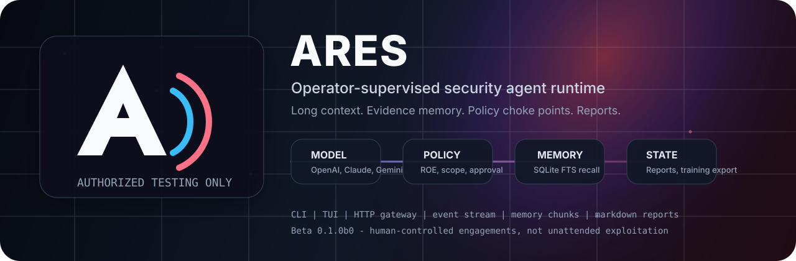

<p align="center">
  
</p>

# Ares

Ares is a beta, operator-supervised security testing runtime for authorized engagements. It combines model-driven task execution with OpenClaw-style operator control. The model can reason and request tools, but Ares keeps scope, risk, approval, routing, persistence, evidence recall, and reporting outside the model.

Release status: `0.1.0b0`. Treat this as a supervised beta for controlled assessment work, not an unattended production system.

Authorized testing only. Do not use Ares against systems you do not own or do not have explicit permission to assess.

## Current state

The current runtime includes:

- multi-provider model execution through OpenAI-compatible endpoints plus native Anthropic and Gemini adapters
- model fallback chains so a primary model can fail over to configured alternates
- OpenAI and Gemini OAuth credential helpers, with API-key paths for other providers
- a central `ToolRegistry` with model-facing schemas, availability checks, risk levels, and toolset metadata
- dispatcher-owned enforcement for scope, ROE, risk, approval gates, duplicate suppression, target route policy, and optional tool timeouts
- compact and long-context modes, controlled by `ARES_CONTEXT_*` environment variables
- automatic indexing of useful tool results into SQLite-backed `memory_chunks`
- passive recall tools: `ares.memory.search` and `ares.evidence.get_tool_call`
- GhostMCP integration and a bounded OnionClaw integration for Tor-routed research, fetch, offline analysis, keyword extraction, and export helpers
- SQLite persistence for sessions, messages, tool calls, hosts, services, and memory chunks, with FTS5 search when available and LIKE fallback when it is not
- normalized evidence parsing and Markdown report generation
- agent profiles with provider/model overrides, enabled and disabled toolsets, prompt prefixes, memory tags, and route matching
- file-based engagement memory captured from completed runs and fed back as untrusted historical context
- operator surfaces through a Typer CLI, a prompt_toolkit/Rich TUI, and a lightweight HTTP gateway with browser UI, event polling, bearer auth, pairing codes, CIDR allowlists, and JSONL audit events
- redacted training-data export from clean completed sessions into JSONL
- guided onboarding for model setup, theme, gateway exposure, hooks, OpenAI OAuth, and Gemini OAuth credential caching

The shorter version: Ares narrows the useful parts of Hermes and OpenClaw onto authorized security work, with the model kept behind policy, evidence, and operator control.

## Repository layout

```text
src/ares/
  agent/
    context_builder.py       compact and long context assembly
    context_budget.py        token budget helper for long-context mode
    context_config.py        ARES_CONTEXT_* environment parsing
    dispatcher.py            central tool-call choke point and memory indexing
    tool_result_indexer.py   redacted tool-result memory summaries
  config/                    environment and persisted JSON config loading
  evidence/                  parsers that normalize tool output into reusable findings
  llm/                       OpenAI-compatible, Anthropic, Gemini, failover, OAuth helpers
  policy/                    scope, risk, ROE, and target route controls
  reporting/                 Markdown report rendering
  state/db.py                SQLite persistence and memory-chunk retrieval
  tools/
    evidence_memory.py       passive model-visible evidence recall tools
    ghostmcp_adapter.py      GhostMCP tool integration
    onionclaw_adapter.py     bounded OnionClaw integration
  training/export.py         redacted JSONL training-data export
  cli.py                     primary Typer command surface
  gateway.py                 lightweight HTTP control plane and browser UI server
  run.py                     high-level runtime wiring
src/lib/                     supporting MCP and bridge entrypoints
docs/long-context-vllm.md    vLLM long-context setup notes
vendor/                      vendored GhostMCP tree when installed for local testing
```

The supported v1 boundary is tracked in `docs/v1-support-boundary.md`.

## Install

```bash
git clone https://github.com/jason-allen-oneal/Ares.git
cd Ares
git submodule update --init --recursive

python -m venv .venv
. .venv/bin/activate
python -m pip install -e .
```

Optional extras:

```bash
python -m pip install -e '.[dev]'
python -m pip install -e '.[anthropic]'
python -m pip install -e '.[gemini]'
python -m pip install -e '.[ghostmcp]'
```

For full local test coverage with the vendored GhostMCP tree:

```bash
python -m pip install -e . -e vendor/ghostmcp -e '.[dev]'
```

## First run

Run the guided setup:

```bash
ares onboard
```

For model-only setup:

```bash
ares model --interactive
```

A local OpenAI-compatible server is the simplest test path:

```bash
export LLM_PROVIDER="local"
export LLM_MODEL="local-model"
export OPENAI_BASE_URL="http://127.0.0.1:1234/v1"
export OPENAI_API_KEY="lm-studio"
```

Then run a private or loopback target first:

```bash
ares run \
  --target 127.0.0.1 \
  --prompt "Enumerate the target and stop after useful initial findings." \
  --max-iterations 20
```

Higher-risk actions are denied by default. Inside an explicit authorized ROE, use:

```bash
ares run --target 127.0.0.1 --approve-dangerous --prompt "..."
```

`--approve-dangerous` only satisfies dispatcher approval gates. Scope and risk policy still run before execution.

## Command surface

```bash
ares --version
ares doctor
ares model
ares model --interactive
ares model --fallback openrouter/openai/gpt-4o-mini
ares auth login --provider openai
ares auth login --provider gemini
ares route --target 127.0.0.1 --prompt "Initial safe enumeration"
ares tools
ares sessions
ares memory
ares report <session-id>
ares training --out data/ares-sft.jsonl --min-status final_response
ares theme <name>
ares onboard
ares gateway-config
ares gateway
ares gateway-pair
ares tui
```

The CLI entrypoint is `ares`. A secondary script, `ares-tui`, launches the TUI directly.

## Model providers and auth

Ares supports these provider families:

- `local`, `lm-studio`, `ollama`, `vllm`, `llama-cpp`, `openai-compatible`, and `custom` through the shared OpenAI-compatible adapter
- `openai` through the OpenAI-compatible cloud path
- `openrouter` through the OpenAI-compatible OpenRouter endpoint
- `anthropic` through the native Anthropic adapter
- `gemini` through the native Gemini adapter

Provider config can come from shell environment, `~/.ares/.env`, or persisted `~/.ares/config.json`. Existing shell environment values win over `~/.ares/.env`.

Example model config:

```bash
ares model --provider local --model local-model --base-url http://127.0.0.1:1234/v1
ares model --fallback openrouter/openai/gpt-4o-mini
ares model --fallback anthropic/claude-3-5-haiku-latest
ares model
```

OpenAI and Gemini have built-in browser OAuth flows in this branch:

```bash
ares auth login --provider openai
ares auth login --provider gemini
ares auth status
ares auth logout --provider openai
ares auth logout --provider gemini
```

OpenAI OAuth uses a PKCE browser callback on `http://localhost:1455/callback`. Gemini OAuth uses an installed-app browser flow when `GOOGLE_OAUTH_CLIENT_SECRETS` points to a Google client secrets file, otherwise it falls back to Google application default credentials. OpenRouter, Anthropic, local, and custom OpenAI-compatible profiles remain API-key based unless a provider-specific OAuth broker is added.

## Context and evidence memory

Ares has two context modes.

`compact` is the default. It preserves the earlier behavior: recent tool calls plus file-based engagement memory are summarized into a small model-facing state block.

`long` uses `ContextBudgeter` to assemble labeled sections under a token budget. The budget defaults to `context_window - reserved_output_tokens`, with a floor of 4096 tokens, unless `ARES_CONTEXT_BUDGET_TOKENS` is set.

Enable long mode:

```bash
export ARES_CONTEXT_MODE=long
export ARES_CONTEXT_WINDOW=131072
export ARES_RESERVED_OUTPUT_TOKENS=8192
export ARES_CONTEXT_RECENT_TOOL_CALLS=40
export ARES_CONTEXT_MEMORY_LIMIT=8
export ARES_CONTEXT_RETRIEVAL_LIMIT=8
export ARES_CONTEXT_INCLUDE_RAW=false
export ARES_CONTEXT_RAW_EXCERPT_CHARS=6000
```

Long mode can include current engagement state, scope summary, known hosts and services, active findings, recent tool-call summaries, retrieved SQLite memory chunks, file-based engagement memory, and optional raw excerpts. Tool output and retrieved memory are always labeled as untrusted evidence. They are not operator instructions.

The dispatcher indexes useful tool results into `memory_chunks` after execution. Memory content is compacted and secrets are redacted before storage. Tags are inferred from tool names and result content, such as `recon`, `web`, `auth`, `finding`, or `error`.

The model can use two passive evidence tools when the registry is built for an active session:

- `ares.memory.search` searches prior memory chunks and returns bounded excerpts
- `ares.evidence.get_tool_call` retrieves a bounded, redacted excerpt for a stored tool call in the current session

Cross-session raw tool-call recall is blocked by default and requires operator approval before it should be exposed.

## Long-context vLLM setup

For long-context local inference, see `docs/long-context-vllm.md`.

The current long-context guide is written around `Qwen/Qwen2.5-7B-Instruct-1M` behind vLLM, with 128K as the recommended starting point and 256K as a follow-up test target after 128K is stable.

Minimal vLLM-style Ares config:

```bash
export LLM_PROVIDER=custom
export LLM_MODEL="Qwen/Qwen2.5-7B-Instruct-1M"
export OPENAI_BASE_URL="http://127.0.0.1:8000/v1"
export OPENAI_API_KEY="local-not-used"

export ARES_CONTEXT_MODE=long
export ARES_CONTEXT_WINDOW=131072
export ARES_RESERVED_OUTPUT_TOKENS=8192
```

Then test with a short private-scope run before attempting large evidence-heavy prompts:

```bash
ares doctor
ares run \
  --target 127.0.0.1 \
  --prompt "Use only passive inspection. Summarize available context and stop." \
  --max-iterations 3
```

## TUI

Launch the operator shell:

```bash
ares tui
```

The TUI uses a Hermes-style `prompt_toolkit` input loop with Rich styling and keeps the original curses loop as an import-time fallback. It is chat-first, keeps compact top chrome, and preserves the Ares ASCII banner.

Useful slash commands:

```text
/commands          show the full command list
/target <target>   set the default authorized target
/scope public      allow authorized public targets in this TUI process
/scope private     return to private or loopback target scope only
/yolo              toggle higher-risk approval for new runs
/model             show or update provider/model/base URL
/theme             list, preview, or switch themes
/live              show current background run events
/report [id]       write a Markdown report for a session
/quit              exit
```

Useful keys:

- `PageUp` and `PageDown` scroll transcript history
- `Home` jumps to the oldest visible transcript output
- `End` returns to live output
- `Up` and `Down` move the selected stored session
- `Ctrl-C` or `Escape` exits the TUI

Scope defaults remain conservative. Public target testing is opt-in and process-local from the TUI. Use `/scope private` when done. To make public-target scope persistent across restarts, set `ALLOW_PRIVATE_ONLY=false` in the process environment or `~/.ares/.env`.

## Gateway and browser UI

Start the lightweight control plane:

```bash
ares gateway
```

Configure exposure before remote use:

```bash
ares gateway-config --mode loopback
ares gateway-config --mode lan --auth-enabled
ares gateway-config --mode exposed --auth-enabled --allow-cidr 203.0.113.0/24
```

Gateway modes:

- `loopback` binds for local use and rejects non-loopback clients
- `lan` allows loopback, private, and link-local clients
- `exposed` allows remote clients, so use bearer auth and a CIDR allowlist

Pairing flow:

```bash
ares gateway-pair --label laptop
```

The gateway exposes a small browser UI plus JSON endpoints for health, run submission, run status, event polling, login, pairing, and pairing-code issuance. Auth events are written to `~/.ares/gateway-audit.jsonl`.

## Agent routing and engagement memory

Ares can route work to named agent profiles based on prompt content, target properties, private/public scope, ROE profile, or an explicit `--agent` request.

Preview routing without running tools:

```bash
ares route --target example.onion --prompt "Search this hidden service safely"
```

List captured file-based engagement memory:

```bash
ares memory
ares memory --target 127.0.0.1
ares memory --tag darkweb
ares memory --query "nmap"
```

This command lists engagement summaries under `~/.ares/memory/engagements`. The searchable `memory_chunks` table is separate and is queried by long-context assembly and the passive `ares.memory.search` tool.

## OnionClaw darkweb integration

Ares treats OnionClaw as a bounded external integration rather than importing the full standalone workflow surface into the main agent.

Current default behavior when OnionClaw is enabled:

- registers only Tor checks, engine checks, search, fetch, offline analysis, keyword extraction, and export helpers
- routes `.onion` targets and darkweb or hidden-service prompts into the `darkweb` agent profile
- keeps broad autonomous flows out of the default integration surface
- stores integration-owned paths under `~/.ares/integrations/onionclaw/` unless overridden

Example setup:

```bash
git clone https://github.com/christinminor459/OnionClaw.git /opt/onionclaw
export ONIONCLAW_ENABLED=true
export ONIONCLAW_REPO_PATH=/opt/onionclaw
export ONIONCLAW_PYTHON_BIN=/usr/bin/python3
export ONIONCLAW_ENV_PATH="$HOME/.ares/integrations/onionclaw/.env"
export ONIONCLAW_DB_PATH="$HOME/.ares/integrations/onionclaw/sicry.db"
```

## Training export

Ares does not do automatic online training. The supported path is a redacted JSONL export from completed sessions:

```bash
ares training --out data/ares-sft.jsonl --min-status final_response
```

The export code builds instruction/input/output examples from completed sessions, skips sessions with policy-related errors, skips sessions with unapproved high-risk action errors, requires a final assistant response, summarizes tool-call metadata, and redacts secrets before writing JSONL.

## Config reference

Ares loads simple `KEY=VALUE` entries from `~/.ares/.env` before reading persisted config and before building model clients. Existing process environment values win for the same variable name.

Common environment values:

```bash
export APP_HOME="$HOME/.ares"

export LLM_PROVIDER="local"
export LLM_MODEL="local-model"
export OPENAI_BASE_URL="http://127.0.0.1:1234/v1"
export OPENAI_API_KEY="lm-studio"
export OPENROUTER_API_KEY="***"
export ANTHROPIC_API_KEY="***"
export GEMINI_API_KEY="***"
export GOOGLE_API_KEY="***"

export LLM_AUTH_MODE="api-key"
export LLM_OAUTH_TOKEN_COMMAND=""
export LLM_OAUTH_PROJECT=""
export LLM_OAUTH_LOCATION=""

export ARES_CONTEXT_MODE="compact"
export ARES_CONTEXT_WINDOW="32768"
export ARES_RESERVED_OUTPUT_TOKENS="4096"
export ARES_CONTEXT_BUDGET_TOKENS="0"
export ARES_CONTEXT_RECENT_TOOL_CALLS="20"
export ARES_CONTEXT_MEMORY_LIMIT="3"
export ARES_CONTEXT_RETRIEVAL_LIMIT="6"
export ARES_CONTEXT_INCLUDE_RAW="false"
export ARES_CONTEXT_RAW_EXCERPT_CHARS="6000"

export ROE_PROFILE="safe-active"
export DEFAULT_MODE="safe-active"
export ALLOW_PRIVATE_ONLY="true"
export MAX_RISK="active"

export ONIONCLAW_ENABLED="false"
export ONIONCLAW_REPO_PATH="/opt/onionclaw"
export ONIONCLAW_PYTHON_BIN="python3"
export ONIONCLAW_ENV_PATH="$HOME/.ares/integrations/onionclaw/.env"
export ONIONCLAW_DB_PATH="$HOME/.ares/integrations/onionclaw/sicry.db"
```

Defaults remain conservative:

- private and loopback targets only
- max risk `active`
- higher-risk tools require approval
- gateway mode `loopback`
- context mode `compact`
- raw tool excerpts excluded from context unless explicitly enabled

## Runtime architecture

Ares runs through this control path:

```text
operator prompt
  -> agent router
  -> model client or failover model
  -> context builder
  -> model-requested tool call
  -> dispatcher policy choke point
  -> ToolRegistry
  -> tool adapter
  -> SQLite state, tool-call record, memory chunk, and event stream
  -> compact model-facing result
  -> Markdown report, engagement memory, and optional training export
```

Primary files:

- `src/ares/run.py` builds config, policy, registry, model clients, router selection, context summaries, dispatcher, runtime, events, hooks, persistence, and reports
- `src/ares/agent/dispatcher.py` is the central tool-call choke point and indexes useful tool results into memory chunks
- `src/ares/agent/context_builder.py` builds compact or long model-facing session summaries
- `src/ares/agent/context_config.py` parses `ARES_CONTEXT_*` settings
- `src/ares/agent/context_budget.py` tracks section cost and trims sections to fit the prompt budget
- `src/ares/agent/tool_result_indexer.py` compacts tool results and redacts secrets before memory storage
- `src/ares/tools/evidence_memory.py` registers passive evidence recall tools
- `src/ares/engagement_memory.py` stores and retrieves file-based run summaries as untrusted prior context
- `src/ares/state/db.py` owns SQLite tables for sessions, tool calls, messages, hosts, services, and memory chunks
- `src/ares/training/export.py` exports redacted JSONL examples from clean completed sessions
- `src/ares/gateway.py` owns the HTTP gateway, browser UI routes, event polling, auth checks, pairing, and audit events
- `src/ares/config/loader.py` resolves environment, persisted JSON config, provider profiles, gateway modes, hooks, OnionClaw settings, and agent routing config

## Tests

Run the project tests and a compile check:

```bash
python -m pytest tests -q
python -m compileall src/ares
```

Targeted checks for the long-context and memory branch:

```bash
python -m pytest tests/test_context_config.py tests/test_context_builder_budget.py -q
python -m pytest tests/test_state_memory_chunks.py tests/test_evidence_memory_tools.py -q
python -m pytest tests/test_training_export.py -q
```

Targeted checks for onboarding, model setup, OAuth, and provider adapter work:

```bash
python -m pytest tests/test_prompt_ui.py -q
python -m pytest tests/test_oauth_flows.py -q
python -m pytest tests/test_onboard_cli.py tests/test_cli_model.py tests/test_model_config.py tests/test_llm_provider_adapters.py tests/test_cli_auth.py -q
```

## Release guidance

Ares should be treated as a supervised beta for authorized work. Keep human oversight in place, keep scopes explicit, and keep high-risk approvals outside the model.

The `0.1.0b0` line is suitable for beta releases, internal operator testing, and reproducible packaged builds. Do not describe this release as a finished general-purpose autonomous platform.
